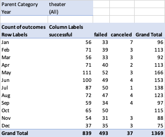

# Kickstarting with Excel

## Overview of Project

### Purpose
This analysis is using data gathered from Kickstarter campaigns to identify varaibles which can impact the success or failure of a campaign, with a focus on theater campaigns similar to the one Louise is planning to launch. By looking for variables that have had a demonstrable impact on the success of past campaigns we will identify strategies that Louise can implement to ensure the greatest possible chance of success for her campaign. We will then use the data gathered and visualize it in such a way that the impact the variable in question has had on past campaigns will be apparent and can treated as actionable insight.
## Analysis and Challenges

### Analysis of Outcomes Based on Launch Date
This analysis began by creating a pivot table from the entire dataset. A Filter was added to the data to only include campaigns that fell under the category of theater to more specifically show the possible effects Louise might experience on her campaign. The pivot table was then filled in with the launch date of the campaign as the row value and the outcome of the campaign as the column values. After these changes were made the table was left with data pertaining only to campaigns relevant to Louise and displaying the relationship between the month the campaing launched and the number of campaigns which succeeded, failed, or were cancelled.



The data found in this table was then used to create a line graph that visualized the relative success theater campaigns could expect based on the month that they were launched in.


### Analysis of Outcomes Based on Goals
This analysis began by manually outlining the variables we would be analyzing and then utilizing the Countifs functionality in Excel to provide the number of campaigns in the play subcategory that were successful, failed, or cancelled based on the fundraising goal, beginning with under $1000 and then using $5000 ranges. The functionality had to be edited for each individual cell to collect the correct data for that entry on the table. An example of the cell which displayed plays which were successful and had a goal between $5000 and $9999 is below.
```
=COUNTIFS(Kickstarter!$R:$R, "plays", Kickstarter!$F:$F, "successful", Kickstarter!$D:$D, ">=5000", Kickstarter!$D:$D, "<9999")
```
That data was then used to find the percentage of campaigns in each range of launch values that were successful, failed, or were cancelled, and that data was added to create the final table.


This table was then used to create a line graph visualizing the relationship between how high the fundraising goal of the campaign was and how likely it was to succeed.


### Challenges and Difficulties Encountered
The most difficult manipulation required of the data was being able to drill down into the categories of campaign given that the dataset originally had both the parent category and the subcategory of the campaign listed together. In order to make this more workable we used the Convert Text to Columns Wizard to separate the text in the cells at the point where the backslash occurred. With this modification it was much simpler to be able to analyze the play subcategory campaigns that would be most relevant to Louise.
## Results

- What are two conclusions you can draw about the Outcomes based on Launch Date?
1. The early summer months, May and June, were the months where both the most total campaigns were successful and where there was the largest gap between number of successful campaigns and failed campaigns. This suggests that launching a play campaign in these months will make it more likely that the campaign will successfully fund.
2. The beginnings of winter, November and December, were the months where both the fewest campaigns were launched and there was the smallest gap between successful and failed campaigns, with there being basically no gap at all in December. This suggests that launching a play campaign in these months will make it less likely that the campaign to successfully fund.
- What can you conclude about the Outcomes based on Goals?
Given the high starting percentage of successful play campaigns at the lower goal amounts and the way that line drops, it seems that campaigns with lower fundrasing goals are more likely to successfully fund. The rate of success does see a notewrothy rebound in the values between $35000-$45000, but further analysis would be required to determine if there is an underlying reason for these variation in overall trend.
- What are some limitations of this dataset?
The subcategory of play can encompass a relatively wide number of possibilities, from one-man shows to large-scale productions involving extensive labor and supplies. As such the scope of this data is not reflective of campaigns that could be considered directly analagous to the one Louise intends to launch, though this is offset somewhat by the analysis of launch goals.
- What are some other possible tables and/or graphs that we could create?
It could be interesting to see whether being selected as a staff pick or spotlighted campaign on the Kickstarter website had any impact on the likelihood of funding. Seeing a bar graph comparing campaign success with or without these endorsements could demonstrate how important, if at all, it is for a campaign in this subcategory to be selected for promotion by Kickstarter. Average donation compared to campaign goal could also be informative, though it would likely also be impacted by pledge levels which is not data that is accessible, but it could still provide insight into how backers are interacting with the campaign.
